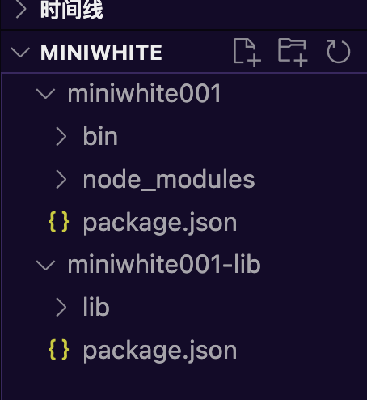

# 脚手架

## 脚手架命令

- npm发布
    - `npm login`
    - `npm publish`
- npm本地调试
    - `npm link`
在npm包发布后，可在本地电脑`/usr/local/lib/node_modules`中查看
- npm移除软链接 `npm remove -g 项目名`


## 多包的情况下本地调试
   
 例如：当前存在同级包`miniwhite001`和`miniwhite001-lib`
  
  ### 本地连接方法步骤
  
  1. 新建`miniwhite001-lib`文件夹；
  2. 终端输入命令：`npm init -y`
  3. 新建`lib/index.js`文件夹及方法。
     
```javascript
// lib js内方法
    module.exports = {
        sum(a,b) {
            return a + b
        }
    }
```
4. 终端输入命令：`npm link`先建立本地软连接。
5. 回到`miniwhite001`文件内，在终端输入`npm link miniwhite001-lib`建立连接；
6. 在index中引入方法

```javascript
#!/usr/bin/env node

const lib = require('miniwhite001-lib');
console.log(lib);
console.log("小白测试001")
```
7. `miniwhite001`终端内输入：`node bin/index.js`进行编译，即可在控制台看到该引用函数。

> 【注1】 在`miniwhite001-lib`中，新建的`index.js`在lib文件夹中，因此在该文件内的`package.json`中需要修改`mian`参数对应的文件位置，应该为`lib/index.js`
  
> 【注2】 由于以上为本地连接，因此在`miniwhite001`文件内执行了`npm link miniwhite001-lib`并不能将该包自动注入`package.json`,因此在本地调试阶段需要手动的添加` "dependencies": {
    "miniwhite001-lib":"^1.0.0"
  }`


## 针对已上线后的本地调试
1. 先进入库包执行`npm link`建立本地连接
   - 在miniwhite001-lib中执行`npm link`
2. 进入脚手架目录，执行`npm link 库名`进行连接本地库
    - 在miniwhite001中执行`npm link miniwhite001-lib`

## 取消本地连接
1. 先进入库包执行`npm unlink`移除本地连接
   - 在miniwhite001-lib中执行`npm unlink`
2. 进入脚手架目录，先删除mode_modules
3. 删除后执行`npm unlink 库名`删除本地库连接
    - 在miniwhite001中执行`npm unlink miniwhite001-lib`

## 理解npm link
- `npm link you-lib`: 将当前项目`node_modules`下指定的库文件链接到`node`全局node_modules下的库文件
- `npm link`：将当前项目链接到`node`全局`node_modules`中做为一个库文件，并解析`bin`配置创建可执行文件